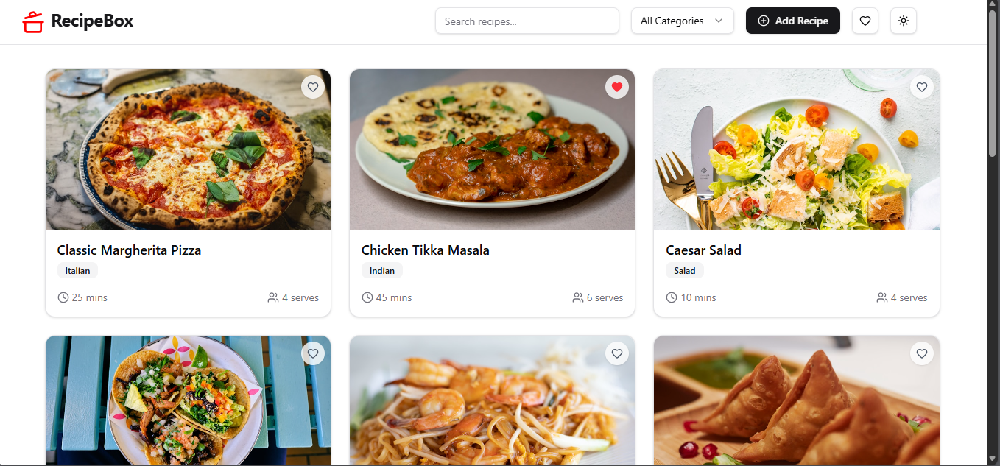
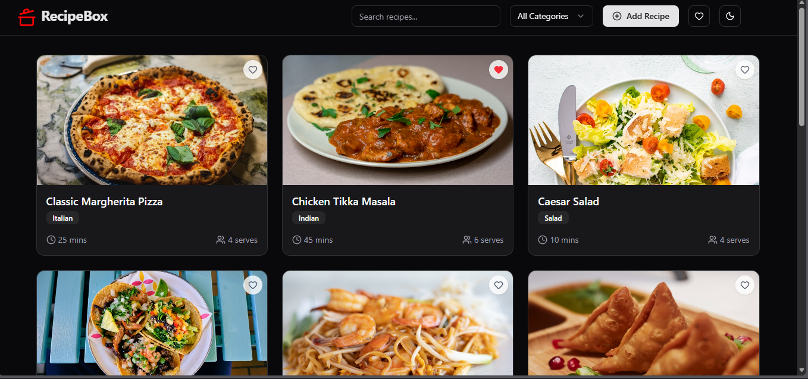
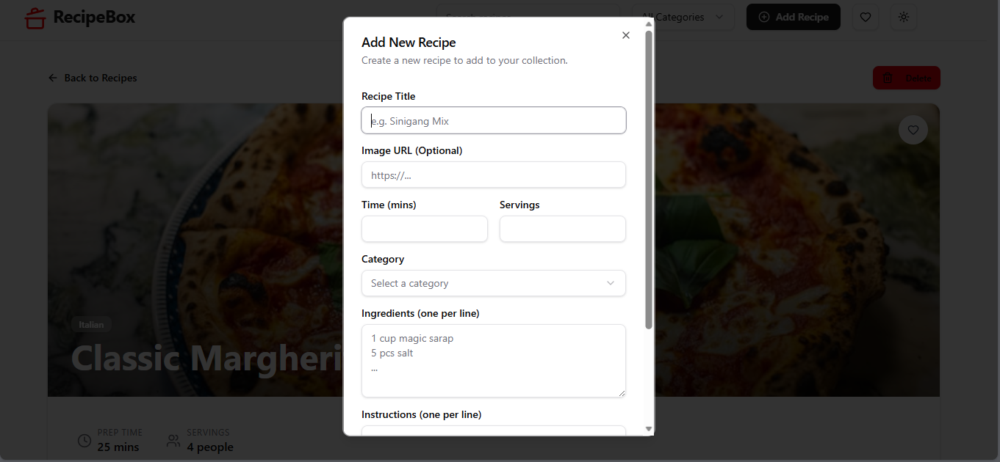
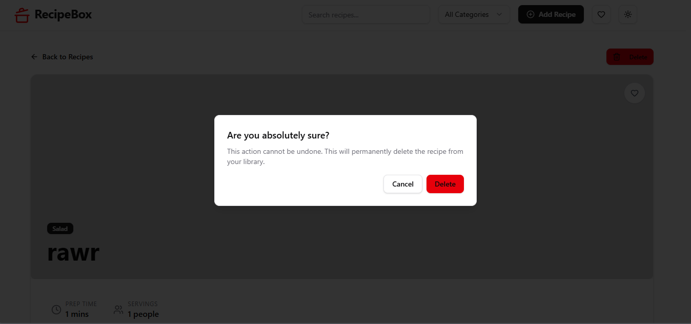
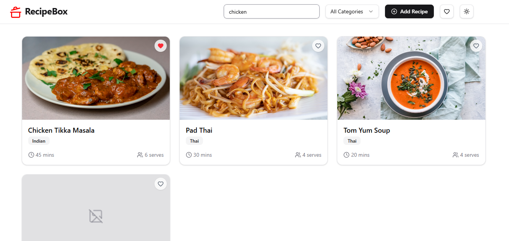
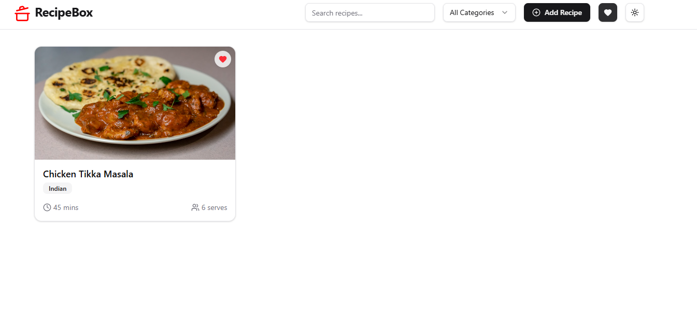

# RecipeBox

RecipeBox is a modern, responsive single-page application built with React and Vite that allows you to manage your personal recipe collection. With a clean UI powered by Tailwind CSS and Shadcn/ui, you can easily browse, search, create, and favorite recipes, with all data persisted locally in the browser.

## Features

- **Browsing Recipes**: View a grid of delicious recipes with images and description.
- **Searching/Filtering**: Filter recipes by title or ingredients instantly.
- **Categories**: Filter recipes by cuisine type.
- **Adding to Favorites**: Save your favorite recipes for easy access.
- **Creating a Custom Recipe**: Add your own recipes to the collection using a simple form.
- **Deleting a Custom Recipe**: Remove recipes you no longer need from your collection.

## Shadcn/ui Components Used

This project utilizes the following components from the Shadcn/ui library:

- `Alert-Dialog`
- `Badge`
- `Button`
- `Card`
- `Dialog`
- `Dropdown-Menu`
- `Input`
- `Label`
- `Scroll-area`
- `Select`
- `Separator`
- `Skeleton`
- `Sonner`
- `TextArea`

## Getting Started

1.  Clone the repository.
2.  Navigate to the project directory:
    ```bash
    cd RecipeBox
    ```
3.  Install dependencies:
    ```bash
    npm install
    ```
4.  Start the development server:
    ```bash
    npm run dev
    ```
5.  Data source and path:
    ```
    RecipeBox\src\recipes.json
    ```

## Screenshots

### Light Mode



### Dark Mode



### Adding Recipe



### Deleting Recipe



### Search Feature



### Show Favorites


